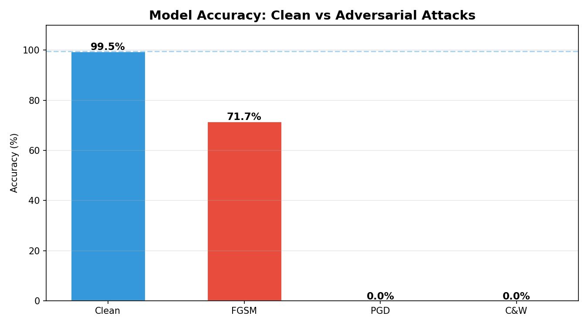
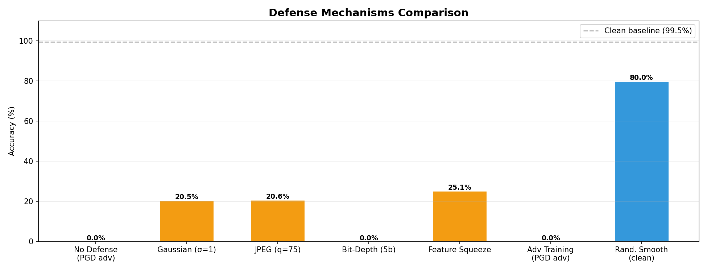
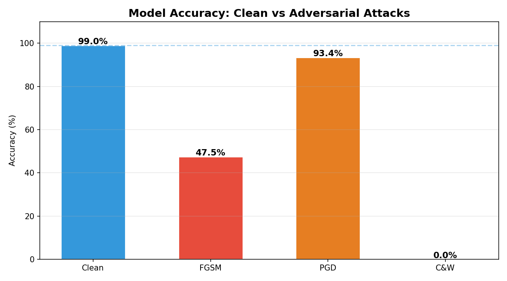
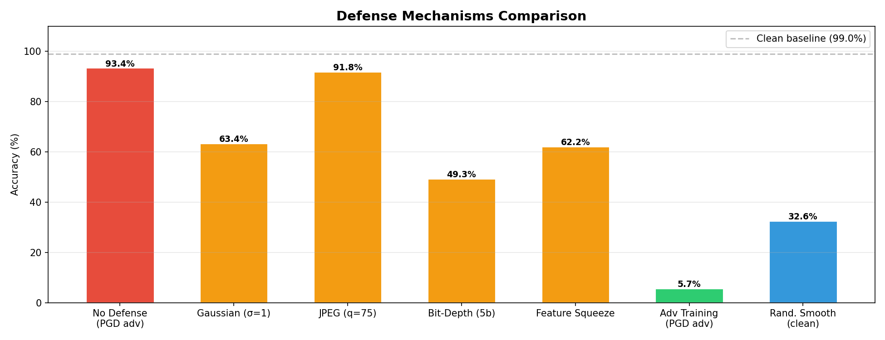

# Adversarial Robustness of Deep Learning Models for Chest X-Ray Pneumonia Classification

## Overview
A comprehensive research study evaluating adversarial attacks and defense mechanisms on medical chest X-ray images using three deep learning architectures on a dataset of 13,981 images.

## Key Findings
- Clean accuracy exceeds 99% across all models
- PGD and C&W attacks reduce accuracy to near 0%, highlighting a critical vulnerability in medical AI systems
- Randomized Smoothing achieves the best defense for ResNet50 at 87.90%
- EfficientNet-B0 demonstrates natural robustness against PGD attacks at 93.41%
- EfficientNet adversarial training achieves 96.79%, the best defense result overall
- No single architecture performs best across all attack and defense scenarios

## Dataset
- Name: Chest X-Ray Pneumonia
- Source: Hugging Face
- Total Images: 13,981
- Classes: NORMAL, PNEUMONIA
- Split: Train (11,184) / Validation (1,400) / Test (1,397)

## Models
| Model | Parameters | Clean Accuracy |
|---|---|---|
| ResNet50 | 25M | 99.28% |
| DenseNet121 | 8M | 99.50% |
| EfficientNet-B0 | 5M | 99.00% |

## Attack Results
| Model | Clean Accuracy | FGSM | PGD-40 | C&W L2 |
|---|---|---|---|---|
| ResNet50 | 99.28% | 81.82% | 0.07% | 0.07% |
| DenseNet121 | 99.50% | 71.65% | 0.00% | 0.00% |
| EfficientNet-B0 | 99.00% | 47.46% | 93.41% | 0.00% |

## Defense Results
| Model | Gaussian | JPEG | Feature Squeeze | Adversarial Training | Randomized Smoothing |
|---|---|---|---|---|---|
| ResNet50 | 53.69% | 34.50% | 57.62% | 27.06% | 87.90% |
| DenseNet121 | 20.47% | 20.62% | 25.13% | 26.77% | 79.96% |
| EfficientNet-B0 | 68.79% | 91.84% | TBD | 96.79% | 32.57% |

## Attacks Implemented
- FGSM: Fast Gradient Sign Method (epsilon = 8/255)
- PGD-40: Projected Gradient Descent with 40 steps (epsilon = 8/255)
- C&W L2: Carlini and Wagner L2 attack with 300 optimization steps on full test set

## Defenses Implemented
- Gaussian Smoothing (sigma = 1)
- JPEG Compression (quality = 75)
- Bit-Depth Reduction (5-bit)
- Feature Squeezing
- Adversarial Training with PGD (20 epochs)
- Randomized Smoothing (certified defense)

## Result Visualizations

### ResNet50

### DenseNet121

### EfficientNet-B0

## Repository Structure
adversarial-medical-xray/
├── README.md
├── Adversarial_Medical_RESEARCH_V2.ipynb
├── Adversarial_DenseNet121_V2.ipynb
├── Adversarial_EfficientNet_V2.ipynb
├── results/
├── results_densenet121/
└── results_efficientnet/

## Conclusions
1. All models achieve above 99% clean accuracy demonstrating strong baseline performance on chest X-ray classification.
2. PGD and C&W attacks completely break all models, revealing a critical vulnerability in deep learning based medical diagnosis systems.
3. EfficientNet-B0 demonstrates natural adversarial robustness against PGD due to its depthwise separable convolution architecture.
4. Randomized Smoothing is the most reliable certified defense for ResNet50 and DenseNet121.
5. Adversarial training performance is affected by class imbalance in medical imaging datasets.
6. Defense effectiveness varies significantly across architectures, indicating no universal solution exists.

## Hardware Used
- GPU: NVIDIA RTX A6000 (48GB VRAM)
- CUDA: 12.4
- PyTorch: 2.6.0

## License
MIT License
